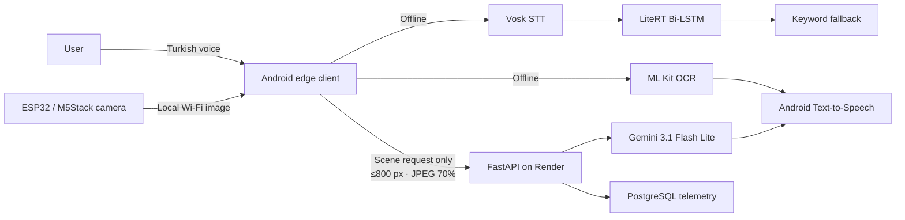

# SmartVision

<p align="center"><strong>A Turkish voice-first visual assistant engineered for continuity, privacy, and meaningful scene understanding.</strong></p>

<p align="center">
    
</p>

SmartVision is a research-driven edge–cloud assistant for visually impaired people. It converts Turkish voice commands into actions, reads printed text aloud, and provides spoken environmental descriptions from a mobile or external camera module. Essential interaction remains on-device; detailed scene understanding is delegated to the cloud only when higher compute provides a clear benefit.

## Design Philosophy: Accessibility Over Aesthetics

SmartVision's interface is intentionally simple. In an assistive product, visual ornament, dense navigation, and interaction novelty can create friction rather than value. The design is therefore optimized for rapid task access, high-contrast presentation, screen-reader compatibility, and low cognitive load—not for decorative complexity.

This minimalism is an engineering decision, not an absence of effort. Large, unambiguous controls and a reduced interaction surface help users recognize the application state and act quickly. The interface prioritizes the user journey that matters: listen, capture or select an image, understand the result, and receive it through speech.

<p align="center">
  
  &nbsp;&nbsp;&nbsp;&nbsp;
  
</p>

## The problem and the hybrid solution

Cloud-only assistants can generate rich descriptions but become fragile when connectivity fails. Fully local solutions preserve privacy and continuity, but mobile hardware is not designed for every multimodal reasoning task. SmartVision makes this trade-off explicit.

| User need | Execution location | Engineering rationale |
|---|---|---|
| Turkish speech-to-text | Android edge | Keeps speech on-device and eliminates network latency. |
| Intent classification | Android edge | Compact LiteRT Bi-LSTM plus deterministic fallback supports offline command handling. |
| OCR and spoken feedback | Android edge | Printed-text reading works without internet; OCR images are not uploaded. |
| External image capture | Local Wi-Fi | ESP32/M5Stack camera communicates directly with the phone; targeted for future wearable form factor. |
| Open-ended scene description | Cloud | A multimodal model provides richer contextual reasoning than the mobile stack targets. |



## Edge intelligence

The Android client uses Vosk (`vosk-model-small-tr-0.3`) for offline Turkish speech recognition, a custom LiteRT/TensorFlow Lite Bi-LSTM for command classification, Google ML Kit Text Recognition for on-device OCR, and Android Text-to-Speech for Turkish feedback. The intent model covers seven actions; its keyword fallback makes uncertain results explicit rather than treating them as actionable predictions. Images over 1024 pixels are proportionally reduced before OCR to control mobile memory use.

The original 1D-CNN classifier was replaced with a Bi-LSTM architecture after a data leakage issue was identified in the training pipeline. The earlier model's augmentation variants leaked across training and validation splits, inflating accuracy. The current model uses GroupShuffleSplit to partition data at the root-pattern level, ensuring the validation set contains only unseen command roots. The class count was reduced from nine to seven: OUT_OF_SCOPE was replaced by a confidence threshold (70%), and OCR_CAPTURE was merged into READ_TEXT since both triggered the same action.

> Text reading is completely offline: OCR runs on the Android device, so the reading flow avoids cloud latency and keeps the captured text image private.

<p align="center"></p>

## Backend and cloud architecture

The online layer is a FastAPI service actively hosted on **Render**, backed by **PostgreSQL** for usage and performance telemetry. It has a deliberately narrow responsibility: authorize scene-analysis requests, invoke the multimodal model, return a concise Turkish description, and record operational metadata.

The client first checks connectivity, bounds the image to 800 pixels, compresses it as JPEG at 70% quality, and sends multipart data. FastAPI authenticates requests through `X-API-Key`; the application key, Gemini API key, database URL, and database-ping token are supplied as environment variables. The service calls Google's `gemini-3.1-flash-lite` with instructions that prioritize people, motion, hazards, obstacles, doors, stairs, vehicles, and spatial context. The free tier provides 15 RPM, 250K TPM, and 500 RPD; paid tiers can be adopted as the project scales.

| Concern | Design response |
|---|---|
| API access | `X-API-Key` gate checked against a server-side secret. |
| Resource control | Async semaphore limits scene analysis to two concurrent requests. |
| Upstream resilience | 30-second multimodal timeout and categorized error handling. |
| Client abandonment | Disconnection checks occur before and after model work. |
| Observability | Structured logs and PostgreSQL telemetry record duration, image size, tokens, outcome, errors, and model name. |

> The scene-analysis flow sends an optimized image to Gemini 3.1 Flash Lite only after an explicit online request, then returns its contextual Turkish description for spoken feedback.

<p align="center"></p>

### Deployment & Telemetry

The FastAPI application is actively deployed on **Render**. It records operational usage metadata in **PostgreSQL**, making latency, token usage, image payload size, action outcomes, and error categories observable for research evaluation and service monitoring.

<p align="center">
  
  <br><br>
  
</p>

## Data and performance

Measurements below are reported in the academic paper for the experimental setup.

| Metric | Reported value | Interpretation |
|---|---:|---|
| Supported intent classes | 7 | Focused, action-oriented command vocabulary. |
| Data split method | GroupShuffleSplit | Root-pattern-level split prevents data leakage across sets. |
| Model architecture | Bi-LSTM | Bidirectional context captures word order variations. |
| Model parameters | 230,407 | Optimized for edge deployment. |
| LiteRT model size | 302 KB | Compact mobile footprint. |
| Intent accuracy | 88.47% | Evaluated on unseen root commands via GroupShuffleSplit. |
| Weighted F1-score | 89.18% | Accounts for class imbalance across seven categories. |
| Offline OCR | ~843 ms | No external network round trip. |
| Cloud scene analysis | ~1,349 ms | Multimodal reasoning offloaded to Gemini 3.1 Flash Lite. |
| Avg. tokens per scene request | 1,258 | Measured across 12 consecutive test requests. |
| Avg. image size per request | 29.6 KB | After client-side JPEG compression. |

| Dimension | Local OCR / intent | Cloud scene analysis |
|---|---|---|
| Network dependency | None | Internet required |
| Optimization goal | Privacy, continuity, response speed | Rich semantic understanding |
| Externally transmitted data | None | Optimized image only for a requested scene analysis |
| Compute target | Android device | Render-hosted FastAPI + Gemini 3.1 Flash Lite |

The accuracy result should be read in context: the training–validation gap (99.9% vs 88.47%) is a direct consequence of GroupShuffleSplit, which ensures the validation set contains command roots never seen during training. This gap confirms the model generalizes rather than memorizes.

## Code quality highlight: defensive local routing

The classifier only accepts an actionable result from the local neural model. Unknown and out-of-scope outcomes are handled by a deterministic local fallback, avoiding unsafe guesses and preventing a network dependency in the command path.

```kotlin
override fun classify(text: String): IntentClassifierResult {
    val cleaned = text.trim()
    if (cleaned.isEmpty()) {
        return IntentClassifierResult.Success(IntentAction.UNKNOWN)
    }

    val primaryResult = primary?.classify(cleaned)
    if (primaryResult is IntentClassifierResult.Success &&
        primaryResult.action != IntentAction.UNKNOWN &&
        primaryResult.action != IntentAction.OUT_OF_SCOPE
    ) {
        return primaryResult
    }

    return fallback.classify(cleaned)
}
```

This compact structure uses normalization and guard clauses to reduce nesting, keeps the primary model replaceable behind an interface, and makes failure behaviour explicit.

## Academic status and conclusion

SmartVision was supported through the **TÜBİTAK 2209-A University Students Research Projects Support Program**. The project was subsequently developed independently, and its technical study is currently being formatted for academic conference submission.

SmartVision demonstrates an accessibility architecture that does not force a choice between offline resilience and capable AI: the edge owns private, immediate interaction, while cloud multimodal reasoning is invoked only where it delivers a meaningful benefit. Future work includes broader user validation, tactile input for noisy environments, expanded command coverage, and compact local multimodal models for offline scene understanding.

---

**Portfolio repository notice:** This public repository presents the SmartVision case study and research outcomes. Production source code, model assets, datasets, credentials, and deployment configuration remain private.
