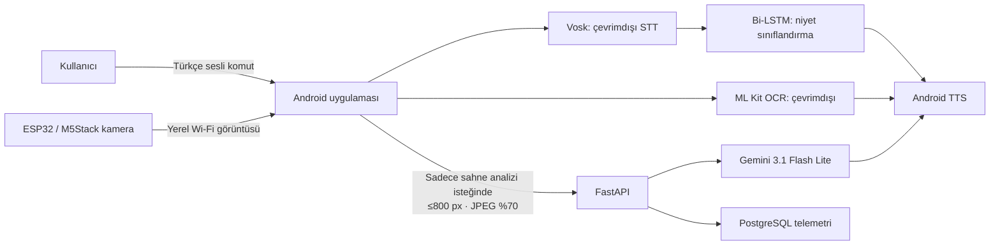

# SmartVision

<strong>Görme engelli bireyler için Türkçe, ses öncelikli ve uç-bulut hibrit yapay zekâ asistanı.</strong>

  
  
  
  
  

SmartVision; görme engelli bireylerin sesli komutlarla çevrelerini anlamalarına, basılı metinleri dinlemelerine ve görüntüleri analiz etmelerine yardımcı olmak amacıyla geliştirilmiş Türkçe destekli bir mobil asistandır.

Sistem, gizlilik ve kesintisiz kullanım gerektiren görevleri cihaz üzerinde çevrimdışı çalıştırırken; daha yüksek hesaplama gücü gerektiren çevresel sahne analizini buluta aktarır.

## Problem ve yaklaşım

Tamamen bulut tabanlı çözümler, zengin görsel betimlemeler sunabilse de internet bağlantısına bağımlıdır. Tamamen yerel çözümler ise gizlilik ve süreklilik sağlarken karmaşık sahneleri yorumlama konusunda mobil donanım sınırlarıyla karşılaşabilir.

SmartVision bu dengeyi uç-bulut hibrit mimarisiyle kurar:

| Kullanıcı ihtiyacı | Çalışma konumu | Kullanılan teknoloji |
|---|---|---|
| Türkçe sesin metne dönüştürülmesi | Android cihaz | Vosk |
| Niyet sınıflandırma | Android cihaz | TensorFlow Lite Bi-LSTM |
| Basılı metin okuma | Android cihaz | ML Kit Text Recognition |
| Sesli geri bildirim | Android cihaz | Android Text-to-Speech |
| Harici kamera ile görüntü alma | Yerel Wi-Fi | ESP32 / M5Stack Timer Camera |
| Çevresel sahne analizi | Bulut | FastAPI + Gemini 3.1 Flash Lite |

## Uç cihazda çalışan özellikler

Android uygulaması; temel kullanıcı etkileşimini internet bağlantısına ihtiyaç duymadan gerçekleştirir.

- **Vosk**, Türkçe sesli komutları cihaz üzerinde metne dönüştürür.
- **Bi-LSTM niyet sınıflandırıcı**, kullanıcının komutunu eylem kategorisine ayırır.
- **ML Kit OCR**, görüntülerdeki basılı metni çevrimdışı olarak algılar.
- **Android Text-to-Speech**, sonuçları Türkçe olarak sesli biçimde iletir.

OCR sırasında görüntü cihaz dışına çıkarılmaz. Bellek kullanımını sınırlamak için 1024 pikselden büyük görüntüler orantılı biçimde küçültülür.

## Güncel niyet sınıflandırma modeli

İlk geliştirme aşamasında kullanılan 1D-CNN tabanlı model, veri artırımı sonucu oluşan aynı kök komutların eğitim ve doğrulama kümelerine birlikte düşmesi nedeniyle veri sızıntısı riski taşıyordu. Bu nedenle sınıflandırıcı mimarisi yeniden tasarlandı ve **Bi-LSTM** tabanlı güncel modele geçildi.

Veri kümeleri, kök komut kalıbı düzeyinde **StratifiedGroupKFold** yöntemiyle ayrıldı. Eğitim kalıplarıyla birebir örtüşen doğrulama ve test ifadeleri ayrıca ayıklandı. Böylece modelin gerçekçi genelleme kapasitesi daha güvenilir biçimde ölçüldü.

### Sınıflar

Model toplam sekiz sınıf üzerinde eğitilmiştir:

1. `READ_TEXT`
2. `TAKE_PHOTO`
3. `PICK_GALLERY`
4. `FETCH_ESP32`
5. `STOP`
6. `REPEAT`
7. `HELP`
8. `OUT_OF_SCOPE`

`OCR_CAPTURE` sınıfı, aynı işlemi tetiklediği için `READ_TEXT` ile birleştirilmiştir. Kapsam dışı ifadeler ise sabit bir güven eşiğiyle değil, doğrudan öğrenilmiş `OUT_OF_SCOPE` sınıfı üzerinden ele alınır.

### Model mimarisi

| Bileşen | Değer |
|---|---|
| Metin vektörleştirme | En fazla 2.500 token, dizi uzunluğu 15 |
| Embedding | 64 boyutlu, `mask_zero=True` |
| Bi-LSTM | 64 birim |
| Dense katman | 32 birim, ReLU ve L2 düzenlileştirme |
| Dropout | %40 |
| Çıkış | 8 sınıflı Softmax |
| Toplam parametre | 230.440 |
| TensorFlow Lite model boyutu | 262 KB |

Maskeli embedding yaklaşımı, kısa komutlardaki dolgu belirteçlerinin model çıktısını baskılamasını önler. Eğitim sürecinde erken durdurma, öğrenme oranı azaltma, L2 düzenlileştirme ve sınıf ağırlıklandırması kullanılmıştır.

### Performans

Arındırılmış test kümesinde elde edilen sonuçlar:

| Metrik | Değer |
|---|---:|
| Test örneği | 2.340 |
| Doğruluk | %78,85 |
| Ağırlıklı F1-skoru | %80,37 |
| Makro F1-skoru | %78,62 |
| Yerel sınıflandırma gecikmesi | `< 100 ms` |
| TensorFlow Lite model boyutu | 262 KB |

  

  

## Bulut tabanlı sahne analizi

Açık uçlu çevresel sahne analizi, yalnızca kullanıcının açıkça bu işlevi istemesi durumunda buluta gönderilir.

İstemci, görüntüyü göndermeden önce:

- Görüntüyü en fazla 800 piksele küçültür.
- JPEG biçiminde %70 kaliteyle sıkıştırır.
- `multipart/form-data` üzerinden FastAPI servisine iletir.

Sunucu, görüntüyü Gemini 3.1 Flash Lite modeliyle analiz eder ve kişi, engel, merdiven, kapı, araç, hareket ve mekânsal bağlam gibi erişilebilirlik açısından önemli unsurlara öncelik veren kısa bir Türkçe betimleme döndürür.

| Özellik | Uygulama |
|---|---|
| Yetkilendirme | `X-API-Key` |
| Eşzamanlı istek sınırı | En fazla 2 sahne analizi |
| Model zaman aşımı | 30 saniye |
| Kayıt sistemi | PostgreSQL telemetrisi |
| Dağıtım | Render |
| Görüntü işleme süresi | Ortalama ~1.349 ms |
| Ortalama istek görüntü boyutu | 29,6 KB |
| Ortalama token tüketimi | 1.258 |

## Gizlilik

SmartVision, veri aktarımını görev bazlı olarak sınırlar.

| İşlev | Ağ gereksinimi | Cihaz dışına çıkan veri |
|---|---|---|
| Ses tanıma | Yok | Yok |
| Niyet sınıflandırma | Yok | Yok |
| OCR / metin okuma | Yok | Yok |
| ESP32 kamera aktarımı | Yerel Wi-Fi | Yerel ağ görüntüsü |
| Sahne analizi | İnternet gerekli | Yalnızca sıkıştırılmış görüntü |

Ses kayıtları ve OCR için kullanılan görüntüler cihaz üzerinde kalır. Sahne analizi için gönderilen görüntüler yalnızca kullanıcının açık talebiyle işlenir.

## Donanım entegrasyonu

Sistem, harici görüntü yakalama için ESP32 tabanlı **M5Stack Timer Camera** modülünü destekler. Kamera, yerel Wi-Fi ağı üzerinden Android istemcisiyle iletişim kurar.

Kullanıcı ilgili komutu verdiğinde uygulama ESP32 cihazına HTTP isteği gönderir; kamera bir görüntü yakalar ve bu görüntüyü mobil uygulamaya döndürür. Görüntü, komuta bağlı olarak yerel OCR akışına veya bulut sahne analizi akışına yönlendirilir.

## Sonuç ve gelecek çalışmalar

SmartVision; metin okuma, sesli komut işleme ve niyet sınıflandırma gibi temel görevleri çevrimdışı sunarken, yalnızca karmaşık görsel analizlerde bulutun hesaplama gücünden yararlanır. Böylece erişilebilirlik, gizlilik ve işlevsellik arasında dengeli bir çözüm sağlar.

Gelecek çalışmalar şunları içerir:

- Gürültülü ortamlar için dokunsal giriş ve fiziksel kontrol seçenekleri
- Daha geniş kullanıcı testleri
- Türkçe fastText veya BERT tabanlı önceden eğitilmiş kelime gömmeleri
- Harici kamera modülünün giyilebilir bir forma dönüştürülmesi
- Yerel, küçük ölçekli çok kipli modellerle çevrimdışı sahne analizi

---

**Portföy notu:** Bu açık depo SmartVision projesinin vaka çalışmasını ve araştırma çıktılarını sunar. Üretim kaynak kodu, model varlıkları, veri kümeleri, kimlik bilgileri ve dağıtım yapılandırmaları özeldir.
